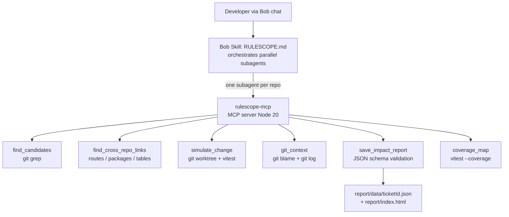

# Project: Task A1 "RuleScope" for the IBM Bob 2.0 hackathon. Workflow we improve: a developer receives a change request (plain text, GitHub issue, or PDF/DOCX spec) for an existing codebase — possibly spread across several connected repositories (e.g. a backend and a mobile app) — and doesn't know where to start. The request can be ANY kind of change: business logic (e.g. "free shipping from €50"), technical migration (e.g. "migrate from SQLite to PostgreSQL"), library replacement, API contract change, or refactoring. Scope of this prototype: TypeScript/JavaScript repositories.Before coding, RuleScope produces an "Impact Brief" backed by tool evidence, not guesses:1) request understanding + open questions to ask before coding,2) affected entry points (web/mobile/API/jobs/scripts), across repositories,3) files to CHANGE / to CHECK / NOT affected, per repository,4) impacted items and how they interact: business rules and their evaluation order, or technical dependencies (database-specific SQL, driver calls, config, hardcoded hosts), plus contradictions, duplicates, hidden usages and cross-repository links,5) current behavior measured by executing code with sample inputs, AND a simulation of the proposed change applied in a temporary copy of the repository, showing a before/after table of outputs (never touching the real code),6) git history: why each impacted item exists and who last changed it,7) test coverage gaps,8) risk level and effort estimate,9) step-by-step safe change plan that Bob can then apply in Agent mode.Evidence rule: every finding is proven by a test run when executable; otherwise by exact file:line evidence from a tool result. Never by guessing. If consumers may exist outside the analyzed repositories, say so explicitly ("unknown external consumers — verify with other teams").Outputs: the brief is shown in the Bob chat (so the developer can ask follow-up questions and apply the plan), AND saved as JSON rendered by a web page in report/.Design a TypeScript MCP server "rulescope-mcp" (official MCP TypeScript SDK, Node 20, no external binaries; use `git grep` for search). Every tool accepts one or several repository paths. Tools, by priority:MUST:- find_candidates(repoPaths[], keywords[], patterns[]): keywords and regex patterns (e.g. SQL dialect functions), returns file:line:snippet per repository- find_cross_repo_links(repoPaths[]): matches providers and consumers across repositories — HTTP routes vs client calls (e.g. "/api/shipping" defined in one repo, fetched in another), shared package names, shared database tables, event/queue topic names- simulate_change(repoPath, patch, testCode): in a temporary git worktree, runs testCode before and after applying the patch with vitest, returns a before/after result table, always cleaned up (also usable with an empty patch as a simple proof test)- git_context(repoPath, file, startLine, endLine): git blame/log — commits, authors, dates, messages- save_impact_report(reportJson): validated by a JSON schema, written to report/data/<ticketId>.jsonSHOULD:- coverage_map(repoPath, files[]): vitest coverage per impacted file/functionThe Bob skill will launch one subagent per repository in parallel and read the files returned by the tools to establish evaluation order.Define TypeScript types ImpactItem (kind: business_rule | technical_dependency | config | entry_point | cross_repo_link | test, with evidence), SimulationResult and ImpactReport. Save the design to docs/DESIGN.md. Do not implement yet.

---

**Status:** active  **Date:** 2026-09-26

---

### 👤 User

Project: "RuleScope" for the IBM Bob 2.0 hackathon. Workflow we improve: a developer receives a change request (plain text, GitHub issue, or PDF/DOCX spec) for an existing codebase — possibly spread across several connected repositories (e.g. a backend and a mobile app) — and doesn't know where to start. The request can be ANY kind of change: business logic (e.g. "free shipping from €50"), technical migration (e.g. "migrate from SQLite to PostgreSQL"), library replacement, API contract change, or refactoring. Scope of this prototype: TypeScript/JavaScript repositories.

Before coding, RuleScope produces an "Impact Brief" backed by tool evidence, not guesses:
1) request understanding + open questions to ask before coding,
2) affected entry points (web/mobile/API/jobs/scripts), across repositories,
3) files to CHANGE / to CHECK / NOT affected, per repository,
4) impacted items and how they interact: business rules and their evaluation order, or technical dependencies (database-specific SQL, driver calls, config, hardcoded hosts), plus contradictions, duplicates, hidden usages and cross-repository links,
5) current behavior measured by executing code with sample inputs, AND a simulation of the proposed change applied in a temporary copy of the repository, showing a before/after table of outputs (never touching the real code),
6) git history: why each impacted item exists and who last changed it,
7) test coverage gaps,
8) risk level and effort estimate,
9) step-by-step safe change plan that Bob can then apply in Agent mode.
Evidence rule: every finding is proven by a test run when executable; otherwise by exact file:line evidence from a tool result. Never by guessing. If consumers may exist outside the analyzed repositories, say so explicitly ("unknown external consumers — verify with other teams").

Outputs: the brief is shown in the Bob chat (so the developer can ask follow-up questions and apply the plan), AND saved as JSON rendered by a web page in report/.

Design a TypeScript MCP server "rulescope-mcp" (official MCP TypeScript SDK, Node 20, no external binaries; use `git grep` for search). Every tool accepts one or several repository paths. Tools, by priority:
MUST:
- find_candidates(repoPaths[], keywords[], patterns[]): keywords and regex patterns (e.g. SQL dialect functions), returns file:line:snippet per repository
- find_cross_repo_links(repoPaths[]): matches providers and consumers across repositories — HTTP routes vs client calls (e.g. "/api/shipping" defined in one repo, fetched in another), shared package names, shared database tables, event/queue topic names
- simulate_change(repoPath, patch, testCode): in a temporary git worktree, runs testCode before and after applying the patch with vitest, returns a before/after result table, always cleaned up (also usable with an empty patch as a simple proof test)
- git_context(repoPath, file, startLine, endLine): git blame/log — commits, authors, dates, messages
- save_impact_report(reportJson): validated by a JSON schema, written to report/data/<ticketId>.json
SHOULD:
- coverage_map(repoPath, files[]): vitest coverage per impacted file/function
The Bob skill will launch one subagent per repository in parallel and read the files returned by the tools to establish evaluation order.

Define TypeScript types ImpactItem (kind: business_rule | technical_dependency | config | entry_point | cross_repo_link | test, with evidence), SimulationResult and ImpactReport. Save the design to docs/DESIGN.md. Do not implement yet.

---

### 🤖 Assistant

> 🔧 called: use_skill

> 🔧 **use_skill** — create-plan

### 🤖 Assistant

> 🔧 called: list_files

> 🔧 **list_files** — .

### 🤖 Assistant

> 🔧 called: spawn_subagent

> 🔧 **spawn_subagent** — explore

### 🤖 Assistant

> 🔧 called: update_todo_list

The project is a fresh template — no implementation exists yet. This is a pure greenfield design task. Let me now write the plan.

> 🔧 **update_todo_list** — [-] Write docs/DESIGN.md with full TypeScript types, tool signatures, architecture, and report schema
[ ] Write rulescope-mcp-plan.md with sub-tasks for implementation
[ ] Present plan to user for review

### 🤖 Assistant

> 🔧 called: write_file

> 🔧 **write_file** — docs/DESIGN.md

### 🤖 Assistant

> 🔧 called: write_file

Now write the implementation plan:

> 🔧 **write_file** — rulescope-mcp-plan.md

### 🤖 Assistant

> 🔧 called: update_todo_list

> 🔧 **update_todo_list** — [x] Write docs/DESIGN.md with full TypeScript types, tool signatures, architecture, and report schema
[x] Write rulescope-mcp-plan.md with sub-tasks for implementation
[-] Present plan to user for review

### 🤖 Assistant

Both deliverables are written. Here's the architecture summary, followed by a review of the key design decisions for your confirmation.

---

## Architecture

---

## What was designed

### [`docs/DESIGN.md`](docs/DESIGN.md)
Complete design document containing:

- **§4 TypeScript types** — `Evidence`, `ImpactItem` (6 kinds), `SimulationResult`, `SimulationRow`, `RepoCoverage`, `ChangePlanStep`, `ImpactReport` (all nine Impact Brief sections)
- **§5 Tool specs** — all six tools with exact signatures, behaviour steps, and error handling rules
- **§6–7** — Web renderer and Bob skill orchestration
- **§8** — Full file layout
- **§9** — Abbreviated JSON schema with required fields and `evidence.minItems: 1` constraint
- **§10** — The non-negotiable evidence rule

### [`rulescope-mcp-plan.md`](rulescope-mcp-plan.md)
Six ordered sub-tasks, each with intent, expected outcomes, and a todo checklist:

| Sub-task | Scope |
|---|---|
| 1 · Scaffold | `package.json`, `tsconfig.json`, `types.ts`, all stubs, `tsc` passes |
| 2 · Search tools | `find_candidates` + `git_context` + unit tests |
| 3 · Cross-repo links | `find_cross_repo_links` with all 3 signal types + unknown-consumer flag |
| 4 · Simulation engine | `simulate_change` with cleanup guarantee + tests |
| 5 · Report + coverage | `save_impact_report` (schema validation) + `coverage_map` |
| 6 · Renderer + skill | `report/index.html` + `skills/RULESCOPE.md` |

---

## Questions for your review

1. **`simulate_change` worktree path** — I used `/tmp/rulescope-sim-<uuid>`. On Windows (where this workspace runs) `git worktree` can still use a system temp path. Should this default to `os.tmpdir()` in the implementation instead of hard-coding `/tmp`?

2. **`find_cross_repo_links` — DB signal scope** — The design detects `CREATE TABLE`, `FROM`, `JOIN`, `INSERT INTO`, and `topic:` literals via `git grep`. For a TypeScript prototype this will produce noise (e.g. `FROM` in markdown). Should I scope the DB/table scan to `.ts`, `.js`, `.sql` files only?

3. **`coverage_map` scoping** — The spec says "scoped to `files`". Vitest doesn't natively accept a file allow-list for coverage; the implementation would run full coverage and filter the output. Is that acceptable, or do you want a `--testPathPattern` filter instead?

4. **`skills/RULESCOPE.md` location** — I placed the Bob skill in `skills/`. Do you want it at `skills/RULESCOPE.md` or directly at `.bob/skills/RULESCOPE.md` so Bob auto-discovers it?

---

### 👤 User

Answers:
1) Yes, use os.tmpdir() — we are on Windows. Also link the original repo's node_modules into the worktree (fs.symlink type "junction") so vitest can run.
2) Yes, scope the DB/table scan to .ts, .js and .sql files, and only match SQL keywords inside string literals.
3) Yes, run full coverage and filter the output to the requested files.
4) Put it at .bob/skills/impact-brief/SKILL.md so Bob auto-discovers it. A custom mode "rulescope" and mode rules will also be created in .bob/ later.

Also apply these changes to DESIGN.md and rulescope-mcp-plan.md:
- report/data/ must NOT be git-ignored (reports are committed and served by the static page); remove that step from Sub-Task 5.
- Sub-Task 4 must include at least one REAL integration test on a small fixture repo, not only mocks.
- find_cross_repo_links detects router.get("/api/...") providers and fetch("/api/...") or fetch(`${host}/api/...`) consumers; it is called ONCE by the root agent, not by each subagent.
- Sanitize ticketId before using it as a file name.
- report/index.html is built by my teammate: remove it from Sub-Task 6 (Sub-Task 6 = Bob skill only).
Update both files, then stop.

---

### 🤖 Assistant

> 🔧 called: read_file, read_file

> 🔧 **read_file** — rulescope-mcp-plan.md

> 🔧 **read_file** — docs/DESIGN.md

### 🤖 Assistant

> 🔧 called: apply_diff

Now I'll apply all changes to both files in parallel:

> 🔧 **apply_diff** — docs/DESIGN.md

### 🤖 Assistant

> 🔧 called: apply_diff

> 🔧 **apply_diff** — rulescope-mcp-plan.md

### 🤖 Assistant

> 🔧 called: read_file

The patch reported a partial application warning. Let me check what was missed — the Sub-Task 3 intent/expected outcomes block:

> 🔧 **read_file** — rulescope-mcp-plan.md

### 🤖 Assistant

> 🔧 called: apply_diff

The Sub-Task 3 block wasn't updated. Applying it now:

> 🔧 **apply_diff** — rulescope-mcp-plan.md

### 🤖 Assistant

Both files are fully updated. Here's a summary of every change applied:

---

## Changes applied

### [`docs/DESIGN.md`](docs/DESIGN.md)

| Section | Change |
|---|---|
| §5.2 `find_cross_repo_links` | Marked as called **once by root agent**; HTTP provider pattern narrowed to `/api/` paths in `.ts`/`.js`; HTTP consumer pattern specified as `fetch("/api/...")` or `` fetch(`${host}/api/...`) ``; DB/table scan scoped to string literals in `.ts`/`.js`/`.sql` only |
| §5.3 `simulate_change` | Step 1 now uses `os.tmpdir()` instead of `/tmp`; new step 2 documents the `fs.symlink` junction for `node_modules` |
| §5.5 `save_impact_report` | Added ticketId sanitization rule (replace non-alphanumeric/`-`/`_` with `_`, reject if empty); explicit note that `report/data/` is **committed**, not git-ignored |
| §5.6 `coverage_map` | Clarified that full coverage runs and output is filtered to the `files` param |
| §6 Report Web Renderer | Noted as **built by front-end teammate**, not part of MCP sub-tasks |
| §7 Bob Skill Orchestration | Updated path to `.bob/skills/impact-brief/SKILL.md`; `find_cross_repo_links` moved to root agent only (step 4), not per-repo subagents |
| §8 File Layout | `report/data/` label updated; `skills/RULESCOPE.md` replaced with `.bob/skills/impact-brief/SKILL.md` |

### [`rulescope-mcp-plan.md`](rulescope-mcp-plan.md)

| Sub-task | Change |
|---|---|
| Overview | Removed mention of `report/index.html` as MCP output |
| Sub-Task 3 | Intent/outcomes/todos updated for narrowed HTTP patterns, string-literal-only DB scan, root-agent-only calling convention |
| Sub-Task 4 | `os.tmpdir()` + junction symlink added to outcomes and todos; fixture repo (`rulescope-mcp/fixtures/sim-fixture/`) required as prerequisite; real integration test added as a mandatory todo item |
| Sub-Task 5 | `report/data/` gitignore step **removed**; ticketId sanitization added to outcomes and tests; coverage filter clarified |
| Sub-Task 6 | Renamed to "Bob Skill" only; all `report/index.html` todos removed; path updated to `.bob/skills/impact-brief/SKILL.md` |
| Implementation Notes | Added `os.tmpdir()` reminder; added `report/data/` committed reminder |